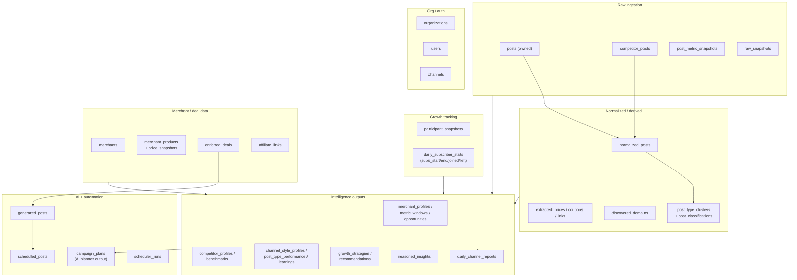
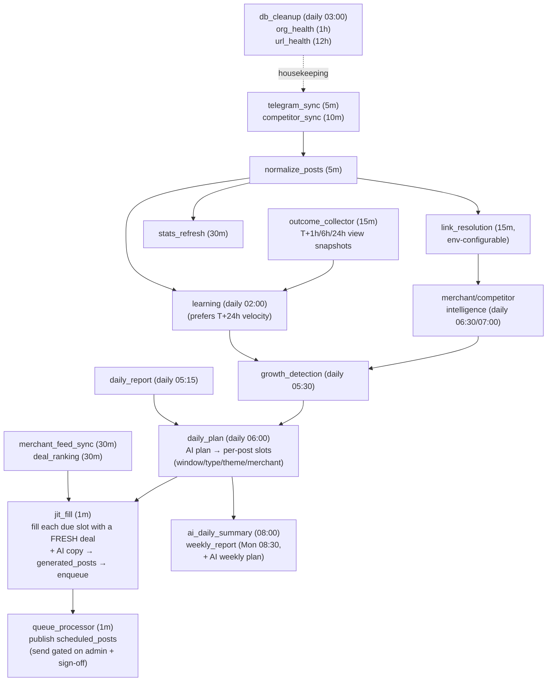
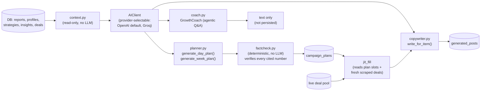

# DealWing / GrabOn — Architecture

One-line version: **Telegram (ours + competitors) + merchant deal API → normalize → analyze/AI → AI daily plan → just-in-time fresh posting → dashboard.**

> The AI plan is now the **source of truth for scheduling** (not a dashboard-only artifact). Each planned slot is filled with freshly-scraped inventory ~3 minutes before it fires and written by the AI copywriter (template fallback). Publishing to Telegram is wired end-to-end but the final send is **intentionally gated** (admin-rights + operator sign-off) — see §4/§5.

---

## 1. System at a glance

**Key fact:** schedulers are **off by default** (`SCHEDULERS_AUTOSTART=false`). Nothing above runs automatically until the registry is started — see §4.

---

## 2. What data we pull, from where

| Source | Method | Collector | What we get | Writes to |
|---|---|---|---|---|
| **Our own channel** | Telegram MTProto (Telethon, logged-in session — full access) | `OwnedChannelCollector` | Full post history, live views/forwards/reactions, subscriber count, admin stats | `posts`, `post_metric_snapshots`, `participant_snapshots`, `daily_subscriber_stats` |
| **Competitor channels** | MTProto if visible, else public `t.me/s` HTML scrape (approximate views only) | `CompetitorCollector` | Post text, approximate views (`views_text`) or exact views if Telethon works | `competitor_posts` |
| **New competitors** | Telegram search + AI-assisted handle verification, **or** manual add via Settings → Competitors (`POST /api/competitors`) | `discovery.py`, `services/collection/onboarding.py` | New candidate channels, classified Direct (platform) vs Indirect (channel-only). A manually-added competitor immediately runs a one-time 7-day backfill + link-resolution + normalization + intelligence pass, then falls into the normal scheduler like any other competitor. | `competitors` |
| **Deal catalogue** | GrabCash Deals API (httpx, Camoufox stealth-browser fallback on 403) | `DealSourceClient` → `DealEnrichmentEngine` | Priced, validated, ranked deal objects | `enriched_deals` |
| **Merchant product pages** | Per-merchant scrapers (Amazon/Flipkart/Boat/Reliance); Ajio/Nykaa/Croma/Zepto/Blinkit are **known-blocked**, never scraped | `MerchantEnrichmentCollector` | Price, MRP, availability | `merchant_products`, `product_price_snapshots` |
| **Shortlinks in our posts** | Async httpx redirect-following — HTTP 3xx **plus** `<meta http-equiv=refresh>` / simple-JS (`window.location`, `location.replace`) bounces (≤2 extra hops, honors the refresh delay capped at 2s), cached | `LinkResolutionEngine` | Final resolved URL → merchant domain (`tldextract` fallback for unlisted domains) | `extracted_links`, `discovered_domains`, backfills `normalized_posts.primary_merchant_key` |

---

## 3. Database map (grouped)

| Group | Table | Purpose |
|---|---|---|
| Raw ingestion | `posts` | Every message on our owned channel, latest observed metrics |
| | `competitor_posts` | Every message we could see on tracked competitor channels |
| | `post_metric_snapshots` | View/forward/reaction time series per owned post (velocity) |
| | `raw_snapshots` | Immutable pointer to raw payload on disk (audit trail) |
| Growth tracking | `participant_snapshots` | Point-in-time subscriber count |
| | `daily_subscriber_stats` | Per-day joined/left/net, upserted every sync cycle |
| Normalized | `normalized_posts` | Structured view of one post: emojis, hashtags, CTA, price flags, merchant match |
| | `extracted_prices/coupons/links` | Parsed sub-entities of a normalized post |
| | `discovered_domains` | Domains seen via link-resolution that aren't in the static merchant list yet |
| | `post_type_clusters`/`post_classifications` | Learned (k-means) post-type labels |
| Merchant/deal | `merchants` | Static registry: which merchants we can/can't scrape |
| | `merchant_products`+`price_snapshots` | Product price history |
| | `enriched_deals` | Validated, ranked deals ready to post |
| | `affiliate_links` | Short→resolved URL + broken-link flag |
| Intelligence | `merchant_profiles`/`opportunities` | Per-merchant performance + AI-flagged opportunities |
| | `competitor_profiles`/`benchmarks` | Us-vs-them behavior comparison (the old `competitor_signals` table was removed — static, no analytical value) |
| | `channel_style_profiles`/`post_type_performance`/`learning_records` | What's working on our own channel |
| | `growth_strategies`/`recommendations` | Ranked growth actions |
| | `reasoned_insights` | "Why did this metric move" narratives |
| | `daily_channel_reports` | Nightly aggregate per channel per day — the AI's main data diet |
| AI/automation | `campaign_plans` | AI-generated daily **and** weekly posting plan, fact-checked against reports; the daily plan's `post_slots` drive `jit_fill` |
| | `deal_scores` | Audience-fit score history per deal (`DealScoringEngine`); feeds planner `scored_deals` |
| | `generated_posts`/`scheduled_posts` | JIT-filled draft → queued → published post pipeline |
| | `post_predictions`/`post_outcomes` | Baseline view/forward prediction per draft + measured T+1h/6h/24h actuals (the latter also feed velocity-based learning) |
| | `weekly_retros` | Last week's predictions vs actuals (weekly retro) |
| | `scheduler_runs` | Audit log of every cron execution |
| Org/auth | `organizations`/`users`/`channels` | Multi-tenant config |

---

## 4. Schedulers — the cron pipeline

All jobs live in `src/controllers/schedulers.py` (APScheduler, IST). **Disabled unless `SCHEDULERS_AUTOSTART=true`.**

| Job | Cadence | Does | Status |
|---|---|---|---|
| `telegram_sync` | 5 min | Pull new owned-channel posts | Live |
| `competitor_sync` | 10 min | Pull new competitor posts | Live |
| `normalize_posts` | 5 min | Raw → `normalized_posts` | Live |
| `link_resolution` | 15 min (`LINK_RESOLVE_INTERVAL_MIN`) | Resolve shortlinks → merchant | Live |
| `stats_refresh` | 30 min | Re-check views/forwards/reactions on recent posts | Live |
| `merchant_feed_sync` | 30 min | Pull + enrich deal feed | Live |
| `outcome_collector` | 15 min | Advance `post_outcomes` through T+1h/6h/24h view snapshots (feeds prediction scoring **and** velocity-based learning) | Live |
| `competitor_discover` | daily 06:30 | Find new competitor channels | Live |
| `competitor_intel` | daily 07:00 | Rebuild competitor profiles/benchmarks (delete-all-then-rebuild-all each run) | Live |
| `learning` | daily 02:00 | Build channel style/performance profile — **prefers true first-24h velocity** (nearest T+24h snapshot), falls back to the cumulative views/age proxy per post | Live |
| `growth_detection` | daily **05:30** | Build growth strategy + recommendations. Runs **before** `daily_plan` so the plan grounds on a fresh blueprint | Live |
| `daily_report` | daily 05:15 | Persist `daily_channel_reports` | Live |
| `daily_plan` | daily **06:00** | Generate today's **AI daily plan** (per-post slots: window/type/theme/merchant) via `ensure_daily_ai_plan`. **No longer pre-renders drafts** — slots are filled just-in-time | Live |
| `jit_fill` | 1 min | For each AI-plan slot due within a 3-min lookahead: scrape the live pool, pick a fresh item matching theme/merchant (broadens + logs on miss), AI-write the post (template fallback), write `generated_posts` + enqueue. Idempotent per slot | Live |
| `weekly_report` | Mon 08:30 | Deterministic weekly plan (`CampaignPlanningEngine`) + **AI weekly plan** (`generate_week_plan` → persisted as the WEEKLY `campaign_plans` row the daily planner reads) | Live |
| `weekly_retro` | Mon 07:30 | Compare last week's predictions vs actuals (before `weekly_report`) | Live |
| `queue_processor` | 1 min | Publish due `scheduled_posts` | Live (send gated on admin rights + sign-off) |
| `notification_engine` | 5 min | Flag blocked posts / failed runs | Live |
| `org_health` | 1 h | Check config completeness | Live |
| `url_health` | 12 h | Sweep `enriched_deals` for dead links | Live |
| `db_cleanup` | daily 03:00 | Delete old `scheduler_runs`/`collection_events` (+ 90-day competitor-intel prune) | Live |
| `monthly_report` | 1st @ 00:05 | 30-day post count | **Placeholder, no dedicated table** |

**Removed jobs (were registered, now deleted):** `deal_ranking` (drove the deleted `DealScoringEngine`), `ai_daily_summary` and the Groq weekly briefing (the free-text briefing generator was removed — the daily/weekly **plan digests** already serve as the operator briefing), plus the `deal_monitoring` / `price_history` / `deal_expiry` / `analytics_aggregation` stubs (no-op or redundant: expiry was a duplicate of `url_health`, aggregation is computed on demand). `monthly_report` stays as an honest placeholder until a dedicated rollup table exists.

There's also a **legacy, unused** `CollectionScheduler` (`services/collection/scheduler.py`) that reads the old `OWNED_INCREMENTAL_INTERVAL_MIN`-style env vars — only reachable via `cli.py`, not wired into the app. Not part of the live system.

### Why it runs in this order (and at these cadences)

The clock times aren't arbitrary — the daily jobs form a strict **producer → consumer chain**, and each one is timed to run *after* whatever it depends on has finished. Rationale lives in `controllers/cadences.py`; the load-bearing points:

**The daily chain (each step feeds the next):**
1. `learning` **02:00** — rebuilds "what's working" from yesterday's *fully-matured* post metrics. Runs in the quiet early morning so the heavy full-history scan is done long before planning.
2. `daily_report` **05:15** — persists yesterday's aggregates (the AI's main data diet).
3. `growth_detection` **05:30** — turns learning + reports into the strategy *blueprint*. Deliberately moved to run **before** the plan — it used to run after, so the plan grounded on a day-old blueprint.
4. `daily_plan` **06:00** — the AI planner is only as good as the blueprint + report beneath it, so it runs **last** in the chain.
5. `jit_fill` **every 1 min** — executes the plan just-in-time, filling each slot ~3 min before it fires, so post content is scraped fresh at fire-time instead of pre-rendered hours stale.
6. `queue_processor` **every 1 min** — publishes due posts (gated).

**Two more ordering constraints that MUST hold:**
- `competitor_discover` **06:30** → `competitor_intel` **07:00** — newly found channels must be *collected* before they're *profiled* (else same-tick profiling sees no posts).
- `weekly_retro` Mon **07:30** → `weekly_report` Mon **08:30** — the report/plan must read a *fresh* retro.

**Why the cadences fall into three tiers:**
- **Near-real-time (1–5 min)** — `telegram_sync`, `normalize_posts`, `jit_fill`, `queue_processor`: freshness-critical. A slot must fill and fire on time, and new posts must be captured before their view-velocity signal decays.
- **Periodic (10–30 min)** — competitor sync, stats refresh, link resolution, merchant feed, deal ranking, outcome collector: useful but not minute-sensitive; batched to limit load on Telegram / merchant sites / our DB.
- **Daily / weekly / monthly** — learning, growth, intel, reports, retros: expensive *delete-all-then-rebuild-per-version* recomputes that only need to reflect a day's or week's change; running them more often would burn compute for no fresher signal.

> **Don't reshuffle times blindly.** These dependencies (`learning → growth → daily_plan`, `daily_report → daily_plan`, `discover → intel`, `retro → weekly_report`, and `jit_fill` only after a plan exists) are encoded *only* by the staggered clock times. Move a time and you can silently feed a stale input downstream — nothing enforces the order at runtime.

---

## 4.5 Content lifecycle — weekly plan → today's plan → publish → learn

The end-to-end flow one post travels, grouped into pre-posting / during / post.

### Phase 0 — Weekly (Monday IST)

| Step | Job (cadence) | What happens | Reads → Writes |
|---|---|---|---|
| Retro | `weekly_retro` (Mon 07:30) | Compare last week's predictions vs actuals | `post_predictions` + `post_outcomes` → `weekly_retros` |
| Weekly plan | `weekly_report` (Mon 08:30) | Deterministic weekly blueprint + AI `generate_week_plan` → week theme / direction / loot-deal ratio | reports/profiles → `campaign_plans` (WEEKLY) |

The WEEKLY row is what the daily planner reads as `this_week_theme` / `direction`.

### Phase 1 — PRE-POSTING: build today's plan (daily chain, ordered by clock)

| Job (cadence) | What happens | Reads → Writes |
|---|---|---|
| `telegram_sync` (5m) / `competitor_sync` (10m) | Pull new owned + competitor posts | Telegram → `posts`, `competitor_posts` |
| `normalize_posts` (5m) | Raw → structured | → `normalized_posts` |
| `link_resolution` (15m) | Resolve shortlinks → merchant | → `extracted_links.merchant_key` |
| `merchant_feed_sync` (30m) | Pull the deal pool from GrabCash | → `enriched_deals` |
| `learning` (02:00) | Rebuild "what's working" from matured metrics | → `channel_style_profiles`, `post_type_performance`, `learning_records` |
| `daily_report` (05:15) | Persist yesterday's aggregates | → `daily_channel_reports` |
| `growth_detection` (05:30) | Learning + reports → strategy blueprint (windows, content mix) | → `growth_strategies` |
| **`daily_plan` (06:00)** | `ensure_daily_ai_plan`: weekly theme + blueprint + reports + `available_deals` + 14-day trajectory → AI `generate_day_plan` → deterministic factcheck → persist | → **`campaign_plans` (DAILY, `post_slots`)** |

The `post_slots` (window / type / theme / merchant) are the day's source of truth. `available_deals` (from `enriched_deals`, no scoring) supplies the merchant/category vocabulary the slots must use.

### Phase 2 — PRE-POSTING: fill each slot just-in-time

| Job (cadence) | What happens | Reads → Writes |
|---|---|---|
| **`jit_fill` (every 1m)** | For each slot due within a 3-min lookahead: scrape the live pool → pick a fresh item matching theme/merchant (loot = distinct categories; deal = one product) → apply our affiliate link → AI copy (`write_for_item`/`write_for_loot`, template fallback) → draft + queue at the slot's fire time + baseline prediction | `campaign_plans` + live deals → `generated_posts`, `scheduled_posts`, `post_predictions` |

Content is scraped fresh ~3 min before it fires — per-minute, not one batch.

### Phase 3 — DURING POSTING: publish

| Job (cadence) | What happens | Reads → Writes |
|---|---|---|
| **`queue_processor` (every 1m)** | Publish due `scheduled_posts` → `Publisher.publish`: revalidate deal → verify admin rights → send → set status | → status `PUBLISHED`/`BLOCKED`/`RETRY`/`FAILED` |

The real send is **hard-gated** (`_check_and_publish` returns `False` — never posts to the owned channel). Dev testing posts to a test chat via `dev_send`. Retries 60→120→240s, max 3.

### Phase 4 — POST-POSTING: measure & close the loop

| Job (cadence) | What happens | Reads → Writes |
|---|---|---|
| `stats_refresh` (30m) | Re-check views/forwards/reactions | → `posts`, `post_metric_snapshots` |
| `outcome_collector` (15m) | Advance each post through T+1h / 6h / 24h view snapshots | → `post_outcomes` |
| `weekly_retro` (Mon) | Predictions vs actuals → next weekly plan | closes the weekly loop |
| `learning` (next 02:00) | Re-read matured metrics → feed tomorrow's plan | **closes the daily loop** |

> **Jobs vs Queue (dashboard):** `scheduler_runs` (Jobs page) = the cron machinery — which background jobs run and their health. `scheduled_posts` (Queue page) = the product — individual posts waiting to publish. The `queue_processor` *job* drains the *queue*.

---

## 5. AI layer — how the AI layer works

- **Every AI call is grounded** — `context.py` builds the JSON bundle from real DB rows first; the LLM never sees free-form access to the database.
- **Fact-checking is deterministic**, not AI: `factcheck.py` checks every number the planner cited against `daily_channel_reports` (2% tolerance) before the plan is marked trustworthy.
- **The planner persists output and it drives scheduling.** `campaign_plans` holds both the AI **daily** plan (per-day, cached per day — see `daily_brief()`/`ensure_daily_ai_plan()`) and the AI **weekly** plan (`generate_week_plan`, persisted Mon 08:30 and read back by the daily planner as `this_week_theme`/`this_week_direction`). The daily plan's `post_slots` are the **source of truth** the `jit_fill` worker executes — no longer a dashboard-only artifact. The plan's `digest` doubles as the operator briefing; coach answers are request/log-only, not stored.
- **Every AI call uses a real system prompt.** `AIClient.complete()` puts `GROUNDING_SYSTEM` + the call's instruction block in the *system* role. The planner, coach and copywriter all pass their instructions via `system_extra=`.
- **Scheduled draft text is AI-first with a deterministic fallback.** `jit_fill` calls `Copywriter.write_for_item()` — it hands the model the slot's freshly-scraped deal plus the org's saved deal/loot **post template as the "winning-format" exemplar** — and only if the AI is unavailable does it fall back to `PostFormatter` template rendering. The post-text templates are **editable** and live in `organizations.settings["post_templates"]` (seeded from code defaults; safe-rendered so a bad edit can never crash generation). The older fully-deterministic engines (`engine.py`) still back the opt-in `/run/generate-live` path.
- `insight_writer.narrate()` is a small AI-assist used *inside* the Growth/Reasoning engines to phrase a "why" sentence from evidence — always has a deterministic fallback string if AI is unavailable.
- **The planner degrades gracefully without AI.** When the AI is unavailable (`ai_available:false`), `/plan/daily` still returns a full deterministic plan — `posting_windows`, `deal_type_allocation`, and `merchant_allocation` are computed by `CampaignPlanningEngine` from real history (see §7 note on cold-start fallbacks). Only the free-text digest / AI-only slots go empty, and `jit_fill` falls back to template-rendered copy.

---

## 5.5 AI call audit — every product LLM call, input → output

**All calls share one client.** `AIClient` (`ai/client.py`) is **provider-selectable** (`AI_PROVIDER`): **OpenAI reasoning** (default `gpt-5-mini-2025-08-07`) when `OPENAI_API_KEY` is set, else **Groq** (`llama-3.3-70b-versatile`). Both go through `chat.completions.create`. Every call sends `system = GROUNDING_SYSTEM + <the per-call prompt>` and `user = <grounded context>`. **No JSON mode** — JSON is prompted for, parsed defensively, then fact-checked. `AIClient.agentic()` (tool loop) is coach/CLI only.

- **OpenAI reasoning path:** goes through the **Responses API** with `reasoning={"effort", "summary":"auto"}` so we capture the model's **diarized reasoning summary** (OpenAI never returns raw CoT — only this summary). System prompt is passed as `instructions`; `max_output_tokens = budget + 2000` headroom (reasoning tokens count against the output budget, so a tight cap would truncate the answer). Groq path uses `chat.completions` with `max_tokens` + `temperature=0.3`; `effort` is a no-op there.
- **Every call is traced** to the **`ai_traces`** table (`db/models_ai_trace.py`), written at the single choke point `AIClient.complete`: input (user), system prompt, output, **reasoning summary**, `reasoning_tokens`/prompt/completion tokens, `reasoning_effort`, provider, model, `latency_ms`, `call` label, `channel_id`, `ok`/`error`, `created_at`. This is the evaluation ledger — replay any row's input against a new model and diff.

> Migration: set `AI_PROVIDER=openai`, `OPENAI_API_KEY=…`, `AI_MODEL=gpt-5-mini-2025-08-07` in `.env` — no code change. Compare outputs by querying `ai_traces` (filter by `call`).

**Prompts merged 4 → 2 this iteration.** The two standalone briefing prompts (`DAILY_INSTRUCTIONS`/`WEEKLY_INSTRUCTIONS`, the old `BriefingGenerator`) were **deleted**: the plan already emits a narrative `digest`, so the day/week plan prompts now absorb the "what to do" / weekly-retro content and their digest *is* the operator briefing. The `ai_daily_summary` job and the write-only `ai_outputs` briefing rows are gone.

| # | Call (fn · file) | Prompt · trace `call` | Trigger | Input (user message) | Output | Params | Persisted |
|---|---|---|---|---|---|---|---|
| 1 | `generate_day_plan` · `ai/planner.py` | `PLAN_INSTRUCTIONS` · `day_plan` | `daily_plan` job 06:00 · regenerate | yesterday report, 14d trajectory, cadence, `available_deals`, posting windows, deal-type alloc, week theme, directive + **steering history** | digest (**doubles as daily briefing**: went-well/badly + do-today) + `===PLAN===` + `post_slots` JSON | `3200`, effort | `campaign_plans` DAILY (fact-checked) + `ai_traces` |
| 2 | `generate_week_plan` · `ai/planner.py` | `WEEK_PLAN_INSTRUCTIONS` · `week_plan` | `weekly_report` job Mon · `/plan/weekly` · regenerate | last-week evidence: post-type perf, merchant opps, follower deltas, retro, directive | digest (**doubles as weekly retro**: win/concern/what-to-change) + `daily_themes`/`direction`/`loot_deal_ratio` JSON | `2000`, effort | `campaign_plans` WEEKLY + `ai_traces` |
| 3 | `Copywriter.write_for_item` · `ai/copywriter.py` | `COPYWRITER_INSTRUCTIONS` · `copywriter_deal` | `jit_fill` (per **deal** slot, 1m) | PRODUCT, FORMAT_REFERENCE (`_deal_examples`), slot theme/merchant, CHANNEL_STYLE; `<link/>` swapped after | `<hook>/<name>/<price>/<cta>` tags → post | `600`, `low` | `generated_posts` + `ai_traces` |
| 4 | `Copywriter.write_for_loot` · `ai/copywriter.py` | `LOOT_INSTRUCTIONS` · `copywriter_loot` | `jit_fill` (per **loot** slot) | ITEMS (label → `<LINK_n>`), price cap, `_loot_examples`, CHANNEL_STYLE | `<theme>/<items>` tags → loot | `600`, `low` | `generated_posts` + `ai_traces` |
| 5 | `insight_writer.narrate` · `ai/insight_writer.py` | `NARRATE_SYSTEM` · `narrate` | inside Growth/Reasoning engines (daily) | kind + observation + evidence JSON | one grounded sentence (deterministic fallback on failure) | `120`, `low` | in `growth_*`/`reasoned_insights` + `ai_traces` |
| 6 | `verify_candidate` · `collection/discovery.py` | `VERIFY_CANDIDATE_SYSTEM` · `verify_candidate` | `competitor_discover` job 06:30 (only when < `competitor_target` and the match is ambiguous) | brand + candidate handles/titles | JSON `{handle, Direct/Indirect}` | `120` | `competitors` + `ai_traces` |

> **CLI-only, excluded from the product runtime (not traced):** `Copywriter.write_for_deal` (`write-post`, same prompt as #3) and `GrowthCoach.ask` (`COACH_SYSTEM` + agentic tool loop, only caller is `cli.py` — no route/scheduler).

**Removed earlier:** `DealScoringEngine` / `deal_ranking` / `deal_scores` / `/deals/scored` (planner reads `available_deals` from `enriched_deals`, no scoring); plan-page Deal queue / merchant-mix graph / trajectory timeline.

**Cost:** the per-post copy calls (3,4) dominate volume; the day/week plans (1,2) are the largest single prompts (~5.5k in / 2.2k out). On `gpt-5-mini` reasoning, per-post copy stays cheap but reasoning tokens add to completion cost — watch `ai_traces.reasoning_tokens` to tune `AI_REASONING_EFFORT`.

---

## 6. From data to dashboard

| Page | Endpoint | Reads |
|---|---|---|
| Overview (`/`) | `/overview`, `/growth`, `/competitor-dashboard`, `/insights`, `/drafts`, `/queue` | `daily_channel_reports`, `daily_subscriber_stats`, competitor profiles, `reasoned_insights` |
| `/analytics` | `/analytics` | `posts`+`normalized_posts` (hour/weekday/type/merchant totals, **posts-per-hour count chart** from `by_hour[].n`, golden hours), `daily_subscriber_stats` (growth) |
| `/day` | `/day` | `posts`+`normalized_posts`+`merchants` for a date or range |
| `/competitors` | `/competitor-dashboard`, `/competitor-dashboard/trends` | `competitor_profiles`/`benchmarks` (ranking, merchant coverage/share, weekday/hour heatmaps) plus day-bucketed posts/views trend across all competitors, computed on demand from `competitor_posts` |
| `/competitors/[id]` | `/competitors/{id}/trends` | Per-competitor deep dive: top posts, content mix, media-vs-text, link usage, caption-length distribution, posting consistency — day-bucketed reads of `competitor_posts`/`normalized_posts`, computed on demand (not persisted) |
| `/plan` | `/plan/daily`, `/plan/weekly` | `campaign_plans` (AI planner + briefing; weekly is keyed to a real IST calendar week and only calls the AI once per week, reusing the cached digest otherwise). Deterministic `posting_windows` / `deal_type_allocation` are computed by `CampaignPlanningEngine` and fall back to owned history when the growth blueprint is cold (§7). |
| `/drafts` | `/drafts` | `generated_posts` |
| `/queue` | `/queue` | `scheduled_posts` |
| `/settings` | `/org`, `/users`, `/channels`, `/competitors` (GET + POST) | `organizations`, `users`, `channels`, `competitors` — the Competitors tab lists/adds competitors (Direct/Indirect); the **Post Templates** tab (owner-only) reads/writes `organizations.settings["post_templates"]` via `PATCH /org` (partial merge) |
| `/schedulers` | `/schedulers/runs` | `scheduler_runs` — per-job cadence, priority, last status, last run, detail |

---

## 7. Code map — where things live (for agents)

Backend rooted at `be/`, frontend at `next/`. Only the load-bearing files are listed; use these as jump-off points.

### Backend (`be/src/`)

| Area | File(s) | What's there |
|---|---|---|
| **HTTP routes** | `routers/` (8 modules) | `data.py` (analytics/day/plan/competitors/drafts/queue + the bulk of GETs), `auth.py`, `users.py`, `channels.py`, `org.py`, `control.py` (`POST /run/pipeline`, `/run/generate-live`), `health.py`. Every response is the envelope `{success, data, error}` via `ok(...)`. |
| **Request-time orchestration** | `controllers/service.py` (~1.5k lines) | The workhorse: `daily_brief()`, `_today_details()`, `weekly` plan assembly, overview/competitor dashboards. Most `/data` routes call into here. |
| | `controllers/jobs.py` | `JobManager` — in-process pipeline/generate-live triggers behind `/run/*`. |
| | `controllers/schedulers.py` | All cron jobs (APScheduler, IST). Off unless `SCHEDULERS_AUTOSTART=true`. |
| | `controllers/accounts.py` | Org/user CRUD. `_EDITABLE_SETTINGS` allow-lists which `org.settings` keys `PATCH /org` may write (includes `post_templates`). |
| **Planning** | `services/planning/campaign.py` | `CampaignPlanningEngine`: `_recent_distribution` (owned 45-day merchant/deal-type counts), `_allocate_posts`/`_allocate_from_recent` (single vs loot mix — cold-start now derives the split from the Growth blueprint's competitor `content_mix_reference`, 60/40 only as last resort), `_recent_hourly_all`/`_recent_posting_windows` (posting-window fallback), `_daily_plan`, `_weekly_plan`, `_risks`. |
| | `services/planning/posting_windows.py` | Shared pure `build_posting_plan(posts_per_day, hourly_all)` + `DAY_PARTS`. Reused by both `campaign.py` and `intelligence/growth.py` (single source of truth for day-part distribution). |
| **Generation** | `services/generation/jit_fill.py` | **`fill_due_slots()`** — the just-in-time executor and the real posting path. Reads AI-plan `post_slots` due within a 3-min lookahead, scrapes the live pool, matches each slot's theme/merchant (`exact → theme → any` broadening, logged), AI-writes via `Copywriter.write_for_item` (template fallback), writes `generated_posts` + enqueues + a baseline `PostPrediction`. Idempotent per slot (`selection_bucket` tag). Has a `_selfcheck()`. |
| | `services/generation/daily_planner.py` | **Retired** deterministic planner — only the `recently_used_urls()` 3-day dedup helper survives; the old `build_and_schedule_day()` was replaced by `jit_fill`. |
| | `services/generation/formatting.py` | `PostFormatter` — deterministic post text (fallback path + `/run/generate-live`). `DEFAULT_POST_TEMPLATES`, safe `_render()` (falls back to default on any bad template). |
| | `services/generation/engine.py` | `PostGenerationEngine`, `LiveDealGenerationEngine` (groups today's fresh deals by category), `ObservedPostGenerationEngine`. Pass `org.settings["post_templates"]` into `PostFormatter`. |
| | `services/generation/deal_source.py` | `DealSourceClient` — live GrabCash feed (reads `DEAL_API_BASE`). |
| | `services/affiliate/grabon.py` | `GrabOnAffiliateProvider` — Amazon/Flipkart affiliate params + `grbn.in` shortening. |
| **Collection** | `services/collection/link_resolution.py` | `LinkResolutionEngine` — shortlink → merchant, incl. meta-refresh/JS follow (`_extract_html_redirect`, `_resolve_one`). |
| | `services/collection/merchants/registry.py` | `MERCHANT_SEED`, `detect_merchant_key()` — the known-domain list. |
| **Processing** | `services/processing/normalizer.py` | `PostNormalizer` — raw post → `normalized_posts` (merchant only from known domains; shortlink resolution is the later link-resolution pass). |
| **Analytics** | `services/analytics/views.py` | `compute()` — the `/analytics` payload (`by_hour[].n`, `golden_hours`, etc.); `_owned_rows()` + `to_ist()` are the canonical owned-post/hour source. |
| | `services/analytics/day.py`, `comparison.py`, `competitor_trends.py` | `/day` summary, us-vs-competitor comparison, per-competitor trends. |
| **Intelligence** | `services/intelligence/growth.py` | `GrowthEngine` — growth blueprint incl. `posting_plan` (via `build_posting_plan`), content-mix. |
| **AI** | `ai/context.py` | Read-only DB→JSON bundlers (grounding). `ai/planner.py` (`generate_day_plan` + `generate_week_plan`), `coach.py`, `copywriter.py` (`write_for_item` fill-time + `write_for_deal` CLI), `factcheck.py`, `insight_writer.py`, `client.py` (provider-selectable OpenAI/Groq — `complete()` takes `system_extra`). Prompts in `ai/prompts/`. |
| **Learning** | `services/learning/channel_learning.py` | `ChannelLearningEngine` — `Fact.view_rate()` prefers true first-24h velocity (nearest T+24h `post_metric_snapshots`) over the cumulative views/age proxy; emits `channel_style_profiles`/`post_type_performance`/`learning_records`. |
| **DB** | `db/models*.py` | ORM split across `models.py` + `models_*.py` by domain. `db/base.py` = `Base`. |
| | `db/migrate.py` | `add_missing_columns(engine)` — the additive-column patcher (**no Alembic**; see §8). |
| | `db/session.py` | `get_engine()`/`get_sessionmaker()` (lru_cache), `session_scope()`. |
| | `db/org_seed.py` | Seeds the default org/user/channels + `post_templates` defaults; DB-wins merge on startup. |
| **Scripts** | `scripts/collect_data.py` | The big CLI ingest/backtest tool (`--initial`, `--backtest`, `--days-back`, `--skip-*`, `--link-resolve-limit`, …). |
| | `scripts/reset_db.py` | Wipe operational data, keep org/users/channels/competitors. Dry-run unless `--yes`. |

### Frontend (`next/`)

| Area | File(s) | What's there |
|---|---|---|
| Pages | `app/(dashboard)/<route>/page.tsx` | `analytics`, `day`, `plan`, `competitors`, `competitors/[id]`, `drafts`, `queue`, `settings/*` (incl. `settings/templates`). |
| Data layer | `queries/queries.ts` (GET hooks), `queries/mutations.ts` (writes), `queries/keys.ts` (query keys) | React Query. `useOrg`/`useUpdateOrg` back the templates editor. |
| API client | `services/api.ts` | `get/post/patch/put/del`; unwraps the `{success,data,error}` envelope. |
| Types | `types/api.ts` | Mirrors backend payloads (`DailyPlanToday`, `PostingWindowRow`, `PostTemplates`, `MetricBucket`, …). |
| Charts | `components/*Chart*`, `settings/settings-nav.ts` | `BarsChart`/`MultiLineChart`/`HeatStrip`; settings nav registration. |

---

## 8. Conventions & gotchas (read before editing)

- **No Alembic.** Schema = `Base.metadata.create_all()` + the hand-written additive patcher `db/migrate.py:add_missing_columns()`. `create_all()` only creates missing *tables*, never ALTERs existing ones — so any new model column must be added to `migrate.py`'s `_ADDITIONS`. This also applies to the dated export `.db` files (`collect_data.py` runs the patcher on them too).
- **Envelope everywhere.** Backend returns `{success, data, error}`; the FE `api` service unwraps `data`. Don't return bare objects from routes.
- **Schedulers off by default** (`SCHEDULERS_AUTOSTART=false`). Nothing ingests/plans automatically in dev — trigger via `scripts/collect_data.py` or the `/run/*` endpoints.
- **Cold-start fallbacks (tiered, not a magic constant).** The plan must never come back empty just because Growth/learning hasn't run. `deal_type_allocation` falls back in order: owned recent single/loot split → the Growth cold-start blueprint's competitor-derived `content_mix_reference` (`{single_deal/loot_deal}` counts over comparable channels) → a neutral 60/40 single/loot default **only** when there's no owned history *and* no usable competitors. `posting_windows` falls back to `_recent_posting_windows` (owned hour distribution weighted by views, same `_owned_rows` source as the analytics chart). Only override these fallbacks when a real growth blueprint is present.
- **Editable templates are safe by construction.** `PostFormatter._render()` catches template errors and falls back to `DEFAULT_POST_TEMPLATES`. When adding a new template string, add its default there and document its placeholders.
- **SQLite pragmas** (`db/session.py`): `foreign_keys=ON`, `journal_mode=WAL`, `busy_timeout=5000` on every connection.
- **Sync SQLAlchemy 2.0** throughout — use `session_scope()`; engines/sessionmakers are `lru_cache`d.
- **IST is the product timezone.** Analytics/schedulers bucket by IST via `to_ist()`; timestamps in the DB are UTC.

---

## 9. AI cost estimation (GPT-4o-mini)

Pricing reference (OpenAI, as of Jul 2026): **$0.15 / 1M input tokens**, **$0.60 / 1M output tokens**. Context window 128K.

### 9.1 Per-call token estimates (current architecture — isolated, stateless calls)

| Call type | Calls/day | Input tok/call | Output tok/call | Daily input tok | Daily output tok |
|---|---|---|---|---|---|
| `generate_day_plan` | 1 | ~5,500 | ~2,200 | 5,500 | 2,200 |
| `generate_week_plan` | 1/week | ~4,000 | ~1,400 | (see Mon) | (see Mon) |
| Daily briefing | 1 | ~2,250 | ~300 | 2,250 | 300 |
| Weekly briefing | 1/week | ~3,500 | ~450 | (see Mon) | (see Mon) |
| `Copywriter.write_for_item` | ~5 | ~750 | ~175 | 3,750 | 875 |
| `insight_writer.narrate` | ~5 | ~650 | ~45 | 3,250 | 225 |
| `verify_candidate` (discovery) | ~2 | ~850 | ~30 | 1,700 | 60 |
| **Typical weekday** | **14** | | | **16,450** | **3,660** |
| Monday (add weekly plan + briefing) | +2 | | | +7,500 | +1,850 |
| **Monday total** | **16** | | | **23,950** | **5,510** |

### 9.2 Daily cost

| Day | Input cost | Output cost | Total |
|---|---|---|---|
| Typical weekday | 16,450 × $0.15/1M = $0.0025 | 3,660 × $0.60/1M = $0.0022 | **$0.0047** |
| Monday | 23,950 × $0.15/1M = $0.0036 | 5,510 × $0.60/1M = $0.0033 | **$0.0069** |

### 9.3 Monthly projection (scheduled crons only)

| Item | Days | Cost |
|---|---|---|
| 28 typical weekdays | 28 | $0.13 |
| 3 Mondays | 3 | $0.02 |
| **Monthly total (scheduled only)** | 31 | **~$0.15** |

### 9.4 With operator usage (on-demand coach)

The GrowthCoach agentic loop averages ~5,000 tokens/question (cumulative across tool-call iterations).

| Coach Q&A sessions/day | Extra daily cost | Monthly total |
|---|---|---|
| 0 (fully automated) | $0.000 | **$0.15** |
| 5 (light operator use) | $0.008 | **$0.39** |
| 20 (heavy operator use) | $0.030 | **$1.05** |

### 9.5 Full agentic rewrite estimate (single agent, all tool calls)

If the entire pipeline were replaced by a **single GPT-4o-mini agent** making sequential tool calls with accumulating context:

| Phase | Cumulative input tok | Output tok |
|---|---|---|
| 8 data-gathering tool calls | ~80,000 | ~800 |
| Planning reasoning | ~20,000 | ~1,000 |
| 5-8 post generations | ~150,000 | ~1,500 |
| Validation + finalization | ~36,000 | ~500 |
| **Total per daily run** | **~286,000** | **~3,800** |

| | Daily | Monthly |
|---|---|---|
| Input cost (286K × $0.15/1M) | $0.043 | |
| Output cost (3.8K × $0.60/1M) | $0.002 | |
| **Agentic daily total** | **$0.045** | **~$1.35** |

### 9.6 Comparison table — all candidate models (monthly)

| Model | Input / 1M | Output / 1M | Monthly (current arch.) | Monthly (agentic rewrite) |
|---|---|---|---|---|
| Groq llama-3.3-70b (current) | Free | Free | $0.00 | — |
| **GPT-4o-mini** | $0.15 | $0.60 | **$0.15** | **$1.35** |
| DeepSeek V3 | $0.27 | $1.10 | $0.27 | ~$2.50 |
| GPT-4o | $2.50 | $10.00 | $2.50 | ~$22.00 |
| Claude 3.5 Sonnet | $3.00 | $15.00 | $3.75 | ~$33.00 |

### 9.7 Takeaway

The current **isolated-call architecture keeps GPT-4o-mini costs under $0.20/month**. A full agentic rewrite would increase costs ~9× to ~$1.35/month — still cheap, but the real risk is latency (sequential tool calls) and token blow-up on complex days. The hybrid approach (deterministic orchestration + AI only for generation) is the sweet spot for cost efficiency.

---

## 9. AI cost estimation — GPT-4o-mini

**Model pricing (OpenAI, as of 2025-09):** Input **$0.15 / 1M tokens** · Output **$0.60 / 1M tokens** · Context window 128K.

All estimates below use the **current isolated-call architecture** (§5) — each AI call is stateless with a fixed-size prompt; there is no agentic context accumulation.

### 9.1 Per-call token budget

| Call | Freq | Input tok (est.) | Output tok (est.) | Notes |
|---|---|---|---|---|
| `generate_day_plan` | 1×/day | 4,000–7,000 | 1,500–2,800 | Heaviest call — bundles reports, trajectory, scored deals, merchant mix, posting windows |
| `generate_week_plan` | 1×/week (Mon) | 3,000–5,000 | 1,000–1,800 | Full weekly briefing context |
| `BriefingGenerator` (daily) | 1×/day | 1,500–3,000 | 200–400 | Insights + recommendations + channel style |
| `BriefingGenerator` (weekly) | 1×/week (Mon) | 2,500–4,500 | 300–600 | Same context as weekly plan |
| `Copywriter.write_for_item` | 3–8×/day | 600–900 | 100–250 | Per JIT-filled slot; `effort="low"` |
| `insight_writer.narrate` | 4–6×/day | 500–800 | 30–60 | GrowthEngine + ReasoningEngine; always has deterministic fallback |
| `verify_candidate` (discovery) | 0–5×/day | 700–1,000 | 20–40 | Only fires for ambiguous competitor candidates |
| `GrowthCoach.ask` (operator) | 0–∞×/day | 3,000–7,500 | 200–500 | Agentic loop (up to 8 iterations); operator-triggered only |

### 9.2 Daily cost — scheduled crons only

| Call type | Calls/day | Input cost | Output cost | Subtotal |
|---|---|---|---|---|
| Daily plan | 1 | $0.0008 | $0.0013 | $0.0021 |
| Daily briefing | 1 | $0.0003 | $0.0002 | $0.0005 |
| Copywriter (×5 avg) | 5 | $0.0006 | $0.0005 | $0.0011 |
| Insight narrator (×5 avg) | 5 | $0.0005 | $0.0001 | $0.0006 |
| Discovery verify (×2 avg) | 2 | $0.0003 | $0.0000 | $0.0003 |
| **Weekday total** | **14** | **$0.0025** | **$0.0021** | **$0.0046** |
| Monday add (weekly plan + briefing) | +2 | $0.0020 | $0.0013 | $0.0033 |
| **Monday total** | **16** | **$0.0045** | **$0.0034** | **$0.0079** |

### 9.3 Monthly projection

| Scenario | Calculation | Monthly cost |
|---|---|---|
| **Scheduled crons only** | 28 weekdays × $0.0046 + 3 Mondays × $0.0079 | **~$0.15** |
| **+ 5 coach Q&A/day** | + 5 × $0.0030 × 30 | **~$0.60** |
| **+ 10 insight narrations/day** (heavy) | + 5 extra × $0.0002 × 30 | **~$0.03** |
| **Full realistic range** | | **$0.15 – $0.78** |
| **Heavy operator usage (20 coach/day)** | + 20 × $0.0030 × 30 | **~$1.95** |
| **Absolute ceiling** | | **< $2.00** |

### 9.4 Comparison with other models (same architecture, monthly)

| Model | Input / 1M | Output / 1M | Monthly (scheduled) | Monthly (realistic) |
|---|---|---|---|---|
| Groq llama-3.3-70b (current) | Free (rate-limited) | Free (rate-limited) | $0.00 | $0.00 |
| GPT-4o-mini | $0.15 | $0.60 | $0.15 | $0.15–$0.78 |
| DeepSeek V3 | $0.27 | $1.10 | $0.27 | $0.27–$1.40 |
| GPT-4o | $2.50 | $10.00 | $2.50 | $2.50–$13.00 |
| GPT-4o **agentic** (single agent, full context accumulation) | $2.50 | $10.00 | — | **$27–$33** |

### 9.5 Why agentic is expensive (for reference)

If the system were refactored to a **single agentic loop** (one agent makes all tool calls, reasons, and generates every post), the cumulative context causes a multiplicative blow-up:

- Turn 1 sends ~3K tokens; turn 8 sends ~35K (all prior turns re-sent).
- A 6-tool-call + 8-slot generation cycle accumulates **~200K input tokens** per daily run.
- At GPT-4o ($2.50/1M in, $10/1M out): **~$0.54/run** → **~$16/month** just for the main loop.
- With all supporting agents (discovery, growth, intel, coach): **$27–$33/month**.

The **current isolated-call design keeps costs under $1/month** because each call is stateless and tightly scoped. The trade-off is more deterministic orchestration code; the payoff is 20–30× lower AI spend.
