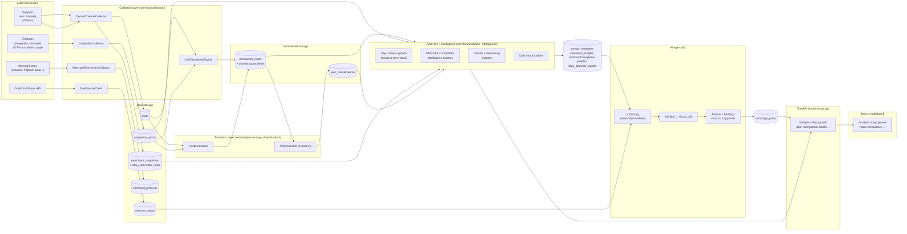
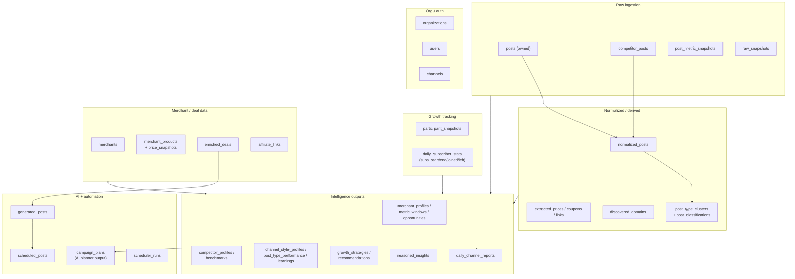
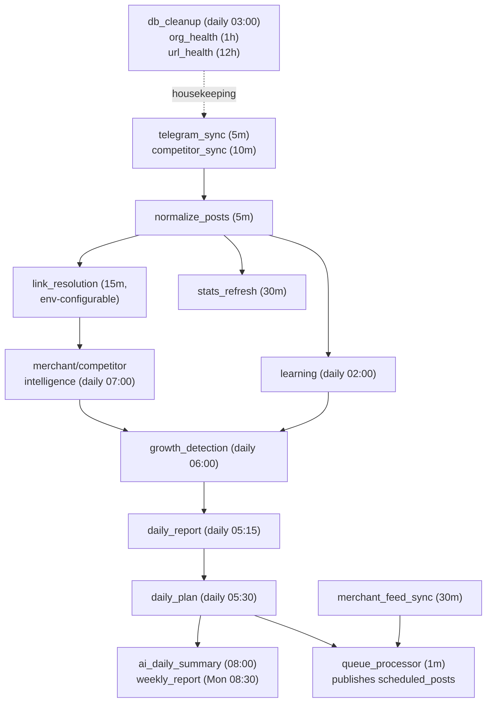
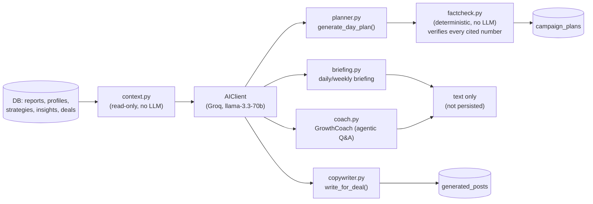

# DealWing / GrabOn — Architecture

One-line version: **Telegram (ours + competitors) + merchant deal API → normalize → analyze/AI → dashboard.**

---

## 1. System at a glance

**Key fact:** schedulers are **off by default** (`SCHEDULERS_AUTOSTART=false`). Nothing above runs automatically until the registry is started — see §4.

---

## 2. What data we pull, from where

| Source | Method | Collector | What we get | Writes to |
|---|---|---|---|---|
| **Our own channel** | Telegram MTProto (Telethon, logged-in session — full access) | `OwnedChannelCollector` | Full post history, live views/forwards/reactions, subscriber count, admin stats | `posts`, `post_metric_snapshots`, `participant_snapshots`, `daily_subscriber_stats` |
| **Competitor channels** | MTProto if visible, else public `t.me/s` HTML scrape (approximate views only) | `CompetitorCollector` | Post text, approximate views (`views_text`) or exact views if Telethon works | `competitor_posts` |
| **New competitors** | Telegram search + AI-assisted handle verification, **or** manual add via Settings → Competitors (`POST /api/competitors`) | `discovery.py`, `services/collection/onboarding.py` | New candidate channels, classified Direct (platform) vs Indirect (channel-only). A manually-added competitor immediately runs a one-time 7-day backfill + link-resolution + normalization + intelligence pass, then falls into the normal scheduler like any other competitor. | `competitors` |
| **Deal catalogue** | GrabCash Deals API (httpx, Camoufox stealth-browser fallback on 403) | `DealSourceClient` → `DealEnrichmentEngine` | Priced, validated, ranked deal objects | `enriched_deals` |
| **Merchant product pages** | Per-merchant scrapers (Amazon/Flipkart/Boat/Reliance); Ajio/Nykaa/Croma/Zepto/Blinkit are **known-blocked**, never scraped | `MerchantEnrichmentCollector` | Price, MRP, availability | `merchant_products`, `product_price_snapshots` |
| **Shortlinks in our posts** | Async httpx redirect-following — HTTP 3xx **plus** `<meta http-equiv=refresh>` / simple-JS (`window.location`, `location.replace`) bounces (≤2 extra hops, honors the refresh delay capped at 2s), cached | `LinkResolutionEngine` | Final resolved URL → merchant domain (`tldextract` fallback for unlisted domains) | `extracted_links`, `discovered_domains`, backfills `normalized_posts.primary_merchant_key` |

---

## 3. Database map (grouped)

| Group | Table | Purpose |
|---|---|---|
| Raw ingestion | `posts` | Every message on our owned channel, latest observed metrics |
| | `competitor_posts` | Every message we could see on tracked competitor channels |
| | `post_metric_snapshots` | View/forward/reaction time series per owned post (velocity) |
| | `raw_snapshots` | Immutable pointer to raw payload on disk (audit trail) |
| Growth tracking | `participant_snapshots` | Point-in-time subscriber count |
| | `daily_subscriber_stats` | Per-day joined/left/net, upserted every sync cycle |
| Normalized | `normalized_posts` | Structured view of one post: emojis, hashtags, CTA, price flags, merchant match |
| | `extracted_prices/coupons/links` | Parsed sub-entities of a normalized post |
| | `discovered_domains` | Domains seen via link-resolution that aren't in the static merchant list yet |
| | `post_type_clusters`/`post_classifications` | Learned (k-means) post-type labels |
| Merchant/deal | `merchants` | Static registry: which merchants we can/can't scrape |
| | `merchant_products`+`price_snapshots` | Product price history |
| | `enriched_deals` | Validated, ranked deals ready to post |
| | `affiliate_links` | Short→resolved URL + broken-link flag |
| Intelligence | `merchant_profiles`/`opportunities` | Per-merchant performance + AI-flagged opportunities |
| | `competitor_profiles`/`benchmarks` | Us-vs-them behavior comparison (the old `competitor_signals` table was removed — static, no analytical value) |
| | `channel_style_profiles`/`post_type_performance`/`learning_records` | What's working on our own channel |
| | `growth_strategies`/`recommendations` | Ranked growth actions |
| | `reasoned_insights` | "Why did this metric move" narratives |
| | `daily_channel_reports` | Nightly aggregate per channel per day — the AI's main data diet |
| AI/automation | `campaign_plans` | AI-generated daily/weekly posting plan, fact-checked against reports |
| | `generated_posts`/`scheduled_posts` | Drafted → queued → published post pipeline |
| | `scheduler_runs` | Audit log of every cron execution |
| Org/auth | `organizations`/`users`/`channels` | Multi-tenant config |

---

## 4. Schedulers — the cron pipeline

All jobs live in `src/controllers/schedulers.py` (APScheduler, IST). **Disabled unless `SCHEDULERS_AUTOSTART=true`.**

| Job | Cadence | Does | Status |
|---|---|---|---|
| `telegram_sync` | 5 min | Pull new owned-channel posts | Live |
| `competitor_sync` | 10 min | Pull new competitor posts | Live |
| `normalize_posts` | 5 min | Raw → `normalized_posts` | Live |
| `link_resolution` | 15 min (`LINK_RESOLVE_INTERVAL_MIN`) | Resolve shortlinks → merchant | Live |
| `stats_refresh` | 30 min | Re-check views/forwards/reactions on recent posts | Live |
| `merchant_feed_sync` | 30 min | Pull + enrich deal feed | Live |
| `competitor_discover` | daily 06:30 | Find new competitor channels | Live |
| `competitor_intel` | daily 07:00 | Rebuild competitor profiles/benchmarks (delete-all-then-rebuild-all each run) | Live |
| `learning` | daily 02:00 | Build channel style/performance profile | Live |
| `growth_detection` | daily 06:00 | Build growth strategy + recommendations | Live |
| `daily_report` | daily 05:15 | Persist `daily_channel_reports` | Live |
| `daily_plan` | daily 05:30 | Build tomorrow's posting plan + queue drafts | Live |
| `ai_daily_summary` | daily 08:00 | Groq daily briefing (text only, not stored) | Live |
| `weekly_report` | Mon 08:30 | Weekly plan + Groq weekly briefing | Live |
| `queue_processor` | 1 min | Publish due `scheduled_posts` | Live (needs admin rights) |
| `notification_engine` | 5 min | Flag blocked posts / failed runs | Live |
| `org_health` | 1 h | Check config completeness | Live |
| `url_health` | 12 h | Sweep `enriched_deals` for dead links | Live |
| `db_cleanup` | daily 03:00 | Delete old `scheduler_runs`/`collection_events` | Live |
| `deal_monitoring`, `price_history`, `deal_ranking` | 2h / 6h / 30m | Stock/price/rank checks | **Stub — always returns "limited"** |
| `monthly_report` | 1st @ 00:05 | 30-day post count | **Placeholder, no dedicated table** |

There's also a **legacy, unused** `CollectionScheduler` (`services/collection/scheduler.py`) that reads the old `OWNED_INCREMENTAL_INTERVAL_MIN`-style env vars — only reachable via `cli.py`, not wired into the app. Not part of the live system.

---

## 5. AI layer — how Groq gets used

- **Every AI call is grounded** — `context.py` builds the JSON bundle from real DB rows first; the LLM never sees free-form access to the database.
- **Fact-checking is deterministic**, not AI: `factcheck.py` checks every number the planner cited against `daily_channel_reports` (2% tolerance) before the plan is marked trustworthy.
- **Only the planner persists output** (`campaign_plans`, cached per day — see `daily_brief()` caching). Briefing and coach answers are request/log-only, not stored.
- `insight_writer.narrate()` is a small AI-assist used *inside* the Growth/Reasoning engines to phrase a "why" sentence from evidence — always has a deterministic fallback string if AI is unavailable.
- **Draft generation is deterministic, not AI.** The live drafts written to `generated_posts` are built by `PostFormatter` (`services/generation/formatting.py`) — plain string templating, no LLM. The post-text templates are **editable** and live in `organizations.settings["post_templates"]` (seeded from code defaults; safe-rendered so a bad edit can never crash generation). `copywriter.py` (`write_for_deal()`) exists but is **CLI-only / optional** — it is not wired into the default generation engines, so the AI diagram's `COPY → generated_posts` edge only applies to that opt-in CLI path.
- **The planner degrades gracefully without AI.** When Groq is unavailable (`ai_available:false`), `/plan/daily` still returns a full deterministic plan — `posting_windows`, `deal_type_allocation`, and `merchant_allocation` are computed by `CampaignPlanningEngine` from real history (see §7 note on cold-start fallbacks). Only the free-text digest / AI-only slots go empty.

---

## 6. From data to dashboard

| Page | Endpoint | Reads |
|---|---|---|
| Overview (`/`) | `/overview`, `/growth`, `/competitor-dashboard`, `/insights`, `/drafts`, `/queue` | `daily_channel_reports`, `daily_subscriber_stats`, competitor profiles, `reasoned_insights` |
| `/analytics` | `/analytics` | `posts`+`normalized_posts` (hour/weekday/type/merchant totals, **posts-per-hour count chart** from `by_hour[].n`, golden hours), `daily_subscriber_stats` (growth) |
| `/day` | `/day` | `posts`+`normalized_posts`+`merchants` for a date or range |
| `/competitors` | `/competitor-dashboard`, `/competitor-dashboard/trends` | `competitor_profiles`/`benchmarks` (ranking, merchant coverage/share, weekday/hour heatmaps) plus day-bucketed posts/views trend across all competitors, computed on demand from `competitor_posts` |
| `/competitors/[id]` | `/competitors/{id}/trends` | Per-competitor deep dive: top posts, content mix, media-vs-text, link usage, caption-length distribution, posting consistency — day-bucketed reads of `competitor_posts`/`normalized_posts`, computed on demand (not persisted) |
| `/plan` | `/plan/daily`, `/plan/weekly` | `campaign_plans` (AI planner + briefing; weekly is keyed to a real IST calendar week and only calls the AI once per week, reusing the cached digest otherwise). Deterministic `posting_windows` / `deal_type_allocation` are computed by `CampaignPlanningEngine` and fall back to owned history when the growth blueprint is cold (§7). |
| `/drafts` | `/drafts` | `generated_posts` |
| `/queue` | `/queue` | `scheduled_posts` |
| `/settings` | `/org`, `/users`, `/channels`, `/competitors` (GET + POST) | `organizations`, `users`, `channels`, `competitors` — the Competitors tab lists/adds competitors (Direct/Indirect); the **Post Templates** tab (owner-only) reads/writes `organizations.settings["post_templates"]` via `PATCH /org` (partial merge) |

No page currently reads `scheduler_runs` — there's no Schedulers status page/router yet, even though the audit table exists.

---

## 7. Code map — where things live (for agents)

Backend rooted at `be/`, frontend at `next/`. Only the load-bearing files are listed; use these as jump-off points.

### Backend (`be/src/`)

| Area | File(s) | What's there |
|---|---|---|
| **HTTP routes** | `routers/` (8 modules) | `data.py` (analytics/day/plan/competitors/drafts/queue + the bulk of GETs), `auth.py`, `users.py`, `channels.py`, `org.py`, `control.py` (`POST /run/pipeline`, `/run/generate-live`), `health.py`. Every response is the envelope `{success, data, error}` via `ok(...)`. |
| **Request-time orchestration** | `controllers/service.py` (~1.5k lines) | The workhorse: `daily_brief()`, `_today_details()`, `weekly` plan assembly, overview/competitor dashboards. Most `/data` routes call into here. |
| | `controllers/jobs.py` | `JobManager` — in-process pipeline/generate-live triggers behind `/run/*`. |
| | `controllers/schedulers.py` | All cron jobs (APScheduler, IST). Off unless `SCHEDULERS_AUTOSTART=true`. |
| | `controllers/accounts.py` | Org/user CRUD. `_EDITABLE_SETTINGS` allow-lists which `org.settings` keys `PATCH /org` may write (includes `post_templates`). |
| **Planning** | `services/planning/campaign.py` | `CampaignPlanningEngine`: `_recent_distribution` (owned 45-day merchant/deal-type counts), `_allocate_posts`/`_allocate_from_recent` (single vs loot mix), `_recent_hourly_all`/`_recent_posting_windows` (posting-window fallback), `_daily_plan`, `_weekly_plan`, `_risks`. |
| | `services/planning/posting_windows.py` | Shared pure `build_posting_plan(posts_per_day, hourly_all)` + `DAY_PARTS`. Reused by both `campaign.py` and `intelligence/growth.py` (single source of truth for day-part distribution). |
| **Generation** | `services/generation/formatting.py` | `PostFormatter` — deterministic post text. `DEFAULT_POST_TEMPLATES`, safe `_render()` (falls back to default on any bad template). |
| | `services/generation/engine.py` | `PostGenerationEngine`, `LiveDealGenerationEngine` (groups today's fresh deals by category), `ObservedPostGenerationEngine`. Pass `org.settings["post_templates"]` into `PostFormatter`. |
| | `services/generation/deal_source.py` | `DealSourceClient` — live GrabCash feed (reads `DEAL_API_BASE`). |
| | `services/affiliate/grabon.py` | `GrabOnAffiliateProvider` — Amazon/Flipkart affiliate params + `grbn.in` shortening. |
| **Collection** | `services/collection/link_resolution.py` | `LinkResolutionEngine` — shortlink → merchant, incl. meta-refresh/JS follow (`_extract_html_redirect`, `_resolve_one`). |
| | `services/collection/merchants/registry.py` | `MERCHANT_SEED`, `detect_merchant_key()` — the known-domain list. |
| **Processing** | `services/processing/normalizer.py` | `PostNormalizer` — raw post → `normalized_posts` (merchant only from known domains; shortlink resolution is the later link-resolution pass). |
| **Analytics** | `services/analytics/views.py` | `compute()` — the `/analytics` payload (`by_hour[].n`, `golden_hours`, etc.); `_owned_rows()` + `to_ist()` are the canonical owned-post/hour source. |
| | `services/analytics/day.py`, `comparison.py`, `competitor_trends.py` | `/day` summary, us-vs-competitor comparison, per-competitor trends. |
| **Intelligence** | `services/intelligence/growth.py` | `GrowthEngine` — growth blueprint incl. `posting_plan` (via `build_posting_plan`), content-mix. |
| **AI** | `ai/context.py` | Read-only DB→JSON bundlers (grounding). `ai/planner.py`, `briefing.py`, `coach.py`, `copywriter.py`, `factcheck.py`, `insight_writer.py`, `client.py` (Groq). Prompts in `ai/prompts/`. |
| **DB** | `db/models*.py` | ORM split across `models.py` + `models_*.py` by domain. `db/base.py` = `Base`. |
| | `db/migrate.py` | `add_missing_columns(engine)` — the additive-column patcher (**no Alembic**; see §8). |
| | `db/session.py` | `get_engine()`/`get_sessionmaker()` (lru_cache), `session_scope()`. |
| | `db/org_seed.py` | Seeds the default org/user/channels + `post_templates` defaults; DB-wins merge on startup. |
| **Scripts** | `scripts/collect_data.py` | The big CLI ingest/backtest tool (`--initial`, `--backtest`, `--days-back`, `--skip-*`, `--link-resolve-limit`, …). |
| | `scripts/reset_db.py` | Wipe operational data, keep org/users/channels/competitors. Dry-run unless `--yes`. |

### Frontend (`next/`)

| Area | File(s) | What's there |
|---|---|---|
| Pages | `app/(dashboard)/<route>/page.tsx` | `analytics`, `day`, `plan`, `competitors`, `competitors/[id]`, `drafts`, `queue`, `settings/*` (incl. `settings/templates`). |
| Data layer | `queries/queries.ts` (GET hooks), `queries/mutations.ts` (writes), `queries/keys.ts` (query keys) | React Query. `useOrg`/`useUpdateOrg` back the templates editor. |
| API client | `services/api.ts` | `get/post/patch/put/del`; unwraps the `{success,data,error}` envelope. |
| Types | `types/api.ts` | Mirrors backend payloads (`DailyPlanToday`, `PostingWindowRow`, `PostTemplates`, `MetricBucket`, …). |
| Charts | `components/*Chart*`, `settings/settings-nav.ts` | `BarsChart`/`MultiLineChart`/`HeatStrip`; settings nav registration. |

---

## 8. Conventions & gotchas (read before editing)

- **No Alembic.** Schema = `Base.metadata.create_all()` + the hand-written additive patcher `db/migrate.py:add_missing_columns()`. `create_all()` only creates missing *tables*, never ALTERs existing ones — so any new model column must be added to `migrate.py`'s `_ADDITIONS`. This also applies to the dated export `.db` files (`collect_data.py` runs the patcher on them too).
- **Envelope everywhere.** Backend returns `{success, data, error}`; the FE `api` service unwraps `data`. Don't return bare objects from routes.
- **Schedulers off by default** (`SCHEDULERS_AUTOSTART=false`). Nothing ingests/plans automatically in dev — trigger via `scripts/collect_data.py` or the `/run/*` endpoints.
- **Cold-start fallbacks.** The plan must never come back empty just because Growth/learning hasn't run. `deal_type_allocation` falls back to the recent single/loot split; `posting_windows` falls back to `_recent_posting_windows` (owned hour distribution weighted by views, same `_owned_rows` source as the analytics chart). Only override these fallbacks when a real growth blueprint is present.
- **Editable templates are safe by construction.** `PostFormatter._render()` catches template errors and falls back to `DEFAULT_POST_TEMPLATES`. When adding a new template string, add its default there and document its placeholders.
- **SQLite pragmas** (`db/session.py`): `foreign_keys=ON`, `journal_mode=WAL`, `busy_timeout=5000` on every connection.
- **Sync SQLAlchemy 2.0** throughout — use `session_scope()`; engines/sessionmakers are `lru_cache`d.
- **IST is the product timezone.** Analytics/schedulers bucket by IST via `to_ist()`; timestamps in the DB are UTC.
